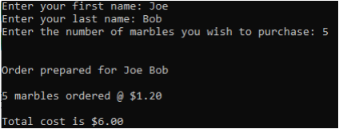

## Chapter 2 - Lab 1 - Joe's Marble Store

### Instructions:
Create a Python program that does the following
- Prompts the user for the following information and stores the entered information in variables
  - First Name  
  - Last Name  
  - Number of marbles the user wishes to purchase
- Creates a named constant variable to hold the cost of marbles which is currently $1.20 per marble
- Calculates the total cost for the purchase
- Displays a formatted invoice showing the full name of the user, the total number of marbles to be purchased, the cost per marble and the total cost of the purchase 

Enter your name, the lab number, and the current date into a set of comments at the top of the code.  
Upload the program source code to the assignment repo. (add, commit and push)

### Grading:
General, compiles, comments, proper indentation, etc  
Variable use   
Input  
Processing  
Output 
